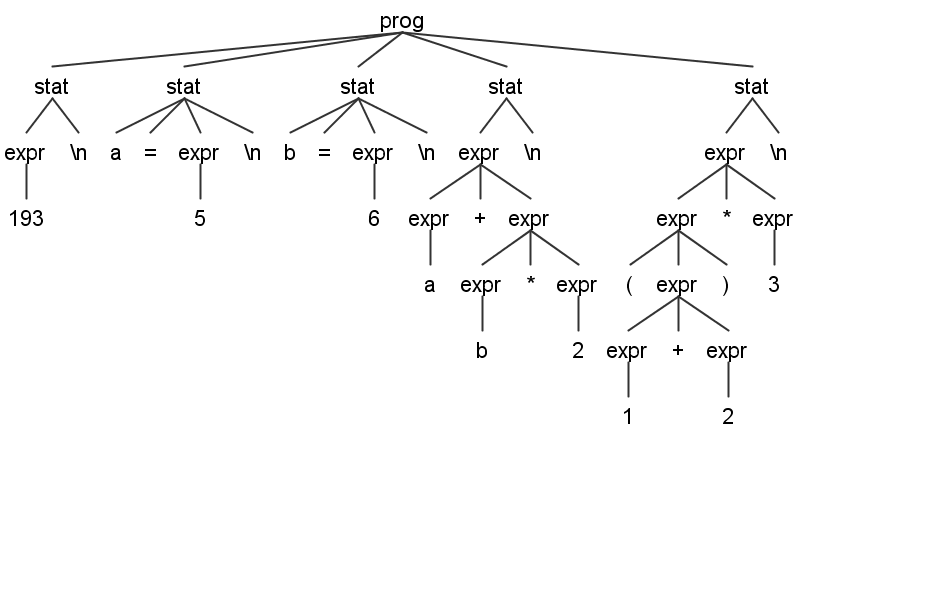

# antlr4语法简介

当我们想要描述一个编程语言时(或者描述一个领域特定语言时), 我会一般会说这个语言用了哪些关键字, 如何进行条件控制,循环,声明赋值,算术运算等等.在antlr中, 使用其自然易懂的规则来标准化的描述这些, 一个分析四则运算表达式的语法规定AddSubMulDiv.g4如下:
``` antlr
grammar AddSubMulDiv;

prog:   stat+ ; 

stat:   expr NEWLINE
    |   ID '=' expr NEWLINE
    |   NEWLINE
    ;

expr:   expr ('*'|'/') expr
    |   expr ('+'|'-') expr
    |   '(' expr ')'
    |   Int
    |   ID
    ;

ID  :   [a-zA-Z_][a-zA-Z_0-9]+ ; // match identifiers
Int :   [0-9]+ ;                 // match integers
NEWLINE:'\r'? '\n' ; 
        // return newlines to parser (is end-statement signal)
WS  :   [ \t]+ -> skip ;         // toss out whitespace
```
描述了`一个AddSubMulDiv程序由很多语句构成, 语句有三种分别是打印表达式或赋值或空行, 表达式由表达式间的乘除加减或者括号围着的表达式以及整数或变量名构成`.  
antlr的语句用`;`来分隔, 第一句`grammer`是关键字, 其后跟着与文件同名的语法的名字.之后的语句, 小写开头的是由语法分析器解析的规则(语法规则rule), 大写开头的是由词法分析器解析的记号(词法规则token).规则名冒号后的就是其内容, 可以把[字符串,正则表达式,语法规则,词法规则]按照类似正则表达式的方式组合, 即
```
a b 代表先匹配a再匹配b
a | b 代表匹配a或者b, 并且a的优先级比b高, (与正则表达式中一样, 表示局部的多选要加括号)
a+ a+? a* a*? a? a?? 分别是匹配[贪婪或非贪婪]的匹配[多个,任意个,1个或0个]规则a
```
其中语法规则只能由语法规则使用, 正则表达式只能由词法规则使用.可以通过关键字`fragment`加到词法规则前, 使之不再作为独立的记号并且无法由语法规则调用.  
`.g4`注释的写法是`/* 块注释 */` , `// 行注释`  
此外值得注意的约定是最后一行出现的`->`, 可以把代码放置到不同的通道, 例如`-> skip`用来直接扔掉注释以及whitespace.

这样的一段代码会被antlr自动生成的词法分析器和语法分析器解析成图中的树
``` js
193
a = 5
b = 6
a+b*2
(1+2)*3
```
  

+ > `expr`的优先级的中的排序的解释:乘除同级大于加减这一级, `Atomic`无需参与优先级放在最后, 而括号组由于括号匹配, 本身是`Atomic`级的强度  
+ > antlr-blockly使用的是antlr4的语法规则的一个子集, 也就是放到antlr4中能够工作的弱化版, 用到了更高级特性的`.g4`文件antlr-blockly无法识别, 这部分 [语法文件规则](grammerFile.md) 中有详细说明.  

- - -

- [Home](README.md)  
- **antlr4语法简介**  
- [blockly运行机制简介](blockly.md)  
- [语法文件规则](grammerFile.md)  
- [demo](demo.md)  