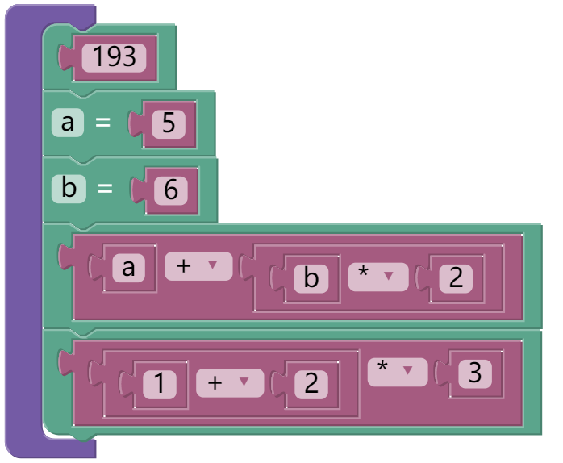
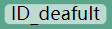
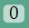

# blockly运行机制简介

## 语法树

先前的代码段转化成blockly图块后如图
``` js
193
a = 5
b = 6
a+b*2
(1+2)*3
```
<p></p><br style="clear:both">

从中可以对比看出, 直接拖拽图块, 拼接构成的结构就是语法树. 色块对应树的结构, 有白色背景的字符对应树的叶节点(之后称这些字符`field`为**`域`**).  
由于树的结构已经能反应次序, `(1+2)*3`在图块中不再需要用`( )`来保证优先级.  
同时blockly也不需要换行符来作为语句结束的标记.  

## 方块的配置

接下来看每个具体的方块是如何运行的, 这是其中赋值方块`assign`的和表达式方块`intExpr`的配置代码  
``` js
{
  "type": "assign",
  "message0": "%1 = %2",
  "args0": [
    {
      "type": "field_input",
      "text": "ID_default",
      "name": "ID_0"
    },
    {
      "type": "input_value",
      "name": "expression_0",
      "check": [
        "expression_arithmetic_0",
        "idExpr",
        "intExpr"
      ]
    }
  ],
  "inputsInline": true,
  "tooltip": "",
  "helpUrl": "",
  "colour": 160,
  "previousStatement": "assign",
  "nextStatement": [
    "printExpr",
    "assign",
    "blank"
  ]
}
```
``` js
{
  "type": "intExpr",
  "message0": "%1",
  "args0": [
    {
      "type": "field_number",
      "value": 0,
      "min": 0,
      "precision": 1,
      "name": "Int_0"
    }
  ],
  "inputsInline": true,
  "tooltip": "",
  "helpUrl": "",
  "colour": 330,
  "output": "intExpr"
}
```
> 这个json是模仿官方提供的 [blockfactory](https://blockly-demo.appspot.com/static/demos/blockfactory/index.html) 产生的`Block Definition: JSON`, 在antlr-blockly实际产生的代码中, 会把重复出现的`["printExpr","assign","blank"]`替换为`AddSubMulDivBlocks.stat`, 以及`["expression_arithmetic_0","idExpr","intExpr"]`替换为`AddSubMulDivBlocks.expression`.  

blockly方块有`value`和`statement`两种, 通过是否包含`output`项来区分, 这里分别称之为**`值块`**和**`语句块`**  
语句块是否包含`previousStatement`和`nextStatement`, 决定了其是否能在上下方向和其他语句块拼接,  
也意味着没有`previousStatement`的语句块, 就是程序的入口.  

图块的内容由`message0`决定, 其中的`1`开始的 `%n` 形式的内容由`args0`的第`n-1`项决定:  
+ `field_`开头的代表用户的直接输入, 也就是语法树的叶节点, 随后会详细说明  
+ `input_dummy`代表换行,  
+ `input_statement`代表嵌入的是语句块, 通过`check`检查第一个块的类型,  
+ `input_value`代表嵌入的是值块, 通过`check`检查类型,  

图块的拼接检查, 逻辑如下:  
+ 值块的`output`提供其块的类型数组,  
  接受value的针脚的`check`提供能接收的类型数组,  
  两者含共同元素或者其中一个是`null`便能拼接.
+ 语句块的`previousStatement`提供其块的类型数组,  
  接受语句块的针脚的`check`提供能接收的类型数组,  
  两者含共同元素或者其中一个是`null`便能拼接.
+ 下方语句块的`previousStatement`提供其块的类型数组,  
  上方语句块的`nextStatement`提供能接收的类型数组,  
  两者含共同元素或者其中一个是`null`便能拼接.
+ > 意味着提供针脚的接受语句的方块, 无法直接控制其接受的第一个语句之外的语句的类型

域`field_`开头的有以下几种:  
+ `field_input` 文本输入  , 通过`text`设置默认值.
+ `field_number` 数字  , 通过`value`设置默认值, 可通过`max`设最大值, 可通过`min`设最小值, 可通过`precision`设精度, 越界或非法输入会自动归为最接近的合法值或者上一个值.
+ `field_checkbox` 布尔值  , 通过`checked`设置默认值.
+ `field_dropdown` 下拉菜单  , 通过`options`设置形如`[["option1","a"],["option2","b"],["option_3","c"]]`的选项, 每一组显示第一个作为字符串, 值为第二个, 默认选中第一组.  
+ > blockly中还支持角度, 颜色作为输入, 常规dsl中这两个输入意义不是很大, 需要生成blockly程序后修改, 或者在`.g4`中用嵌入的函数修改.

## 方块执行的函数

之后是给每个图块写其执行的代码(这三个例子是自动生成的, 需要修改`code`的产生才会有实际的作用)
<pre>
Blockly.JavaScript['prog'] = function(block) {
  var stat_0 = Blockly.JavaScript.<span style="font-weight: bold;color:navy">statementToCode</span>(block, 'stat_0');
  if (stat_0==='') {
    throw new OmitedError(block,'stat_0','prog');
  }
  var code = '1111111111;\n';
  return code;
}
</pre>
<pre>
Blockly.JavaScript['assign'] = function(block) {
  var ID_0 = block.<span style="font-weight: bold;color:navy">getFieldValue</span>('ID_0');
  if (ID_0==='') {
    throw new OmitedError(block,'ID_0','assign');
  }
  ID_0 = AddSubMulDivFunctions.pre('ID')(ID_0);
  var expression_0 = Blockly.JavaScript.<span style="font-weight: bold;color:navy">valueToCode</span>(block, 'expression_0', 
    <span style="font-weight: bold;color:teal">Blockly.JavaScript.ORDER_ATOMIC</span>);
  if (expression_0==='') {
    throw new OmitedError(block,'expression_0','assign');
  }
  var code = '1111111111;\n';
  return code;
}
</pre>
<pre>
Blockly.JavaScript['intExpr'] = function(block) {
  var Int_0 = block.<span style="font-weight: bold;color:navy">getFieldValue</span>('Int_0');
  Int_0 = AddSubMulDivFunctions.pre('Int')(Int_0);
  var code = 0000000000;
  return [code, <span style="font-weight: bold;color:teal">Blockly.JavaScript.ORDER_NONE</span>];
}
</pre>

分别用`getFieldValue,statementToCode,valueToCode`, 从`field_,input_statement,input_value`中取结果, 就可以遍历整个语法树.  

需要注意两点:
+ `valueToCode`时需要给出作用在接受的值块上的优先级, 值块返回时需要给出自身的优先级, 这里优先级意味着一种表达式字符串的结合强度.  
例如`(1+2)*3`, 方块`1+2`的强度是加法, 而方块`?*3`作用在`?`上的强度是乘法,  
乘法的强度大于加法, 因此`valueToCode`会自动给`1+2`加上括号, 组合成`(1+2)*3`,  
这里要理解到一点, 优先级不属于运算这个数学概念, 而是属于描述这个运算的符号(形式).  
`Blockly.JavaScript.ORDER_OVERRIDES`可以消去某些多余的括号, 例如`(1+2)+3 -> 1+2+3`,  
**blockly没有对于左结合或右结合的支持**, 无法描述一个左结合的符号`?`, `(a?b)?c`能去掉括号但是`a?(b?c)`时不能去掉括号.
  > 如果不从语法树生成代码, 而是直接执行, 是不需要考虑优先级的.
+ `statementToCode`没有提供改变调用顺序的接口, 接收的多个语句块只能由其内部机制按照从上到下的顺序遍历.


- - -

- [Start Page](README.md)  
- [antlr4语法简介](antlr4.md)  
- **blockly运行机制简介**  
- [语法文件规则](grammerFile.md)  
- [demo](demo.md)  